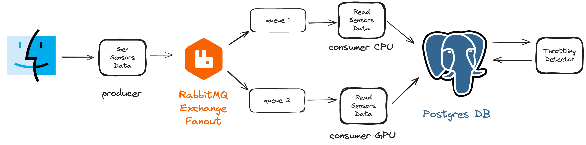

# Macbook Sensor Monitoring
This project utilizes Elixir to monitor CPU and GPU usage on a MacBook. It employs Powermetrics to gather this data. Using a pub-sub approach with RabbitMQ and a fanout exchange, two consumers are set up to aggregate the data into a PostgreSQL database. Another service periodically reads from the database to detect any anomalies in the system's usage.



## Usage

To run the project, you need to have Docker and Docker Compose installed, as well as Elixir.

```bash
brew install elixir
mix deps.get
```

Running `mix deps.get` installs the dependencies listed in `mix.exs`.

```bash
docker-compose up
```

This command starts RabbitMQ and the PostgreSQL database.

To initialize the database, execute the following commands:

```bash
mix ecto.create
mix ecto.migrate
```

Before starting the server, create a `.env` file with the following content:

```bash
password=YOUR_SUDO_PASSWORD
```

This is necessary to run the `powermetrics` command.

The project consists of three components:

- **GenSensorData**: Generates sensor data from powermetrics and sends it to RabbitMQ.
- **ReadSensorData**: Reads sensor data from RabbitMQ and stores it in the database.
- **ThrottlingDetector**: Detects throttling events and stores them in the database.
You can start each component by running the following commands in different terminals:

```bash
iex -S mix run --no-halt -e "GenSensorsData.start_link"
iex -S mix run --no-halt -e "ReadSensorsData.start_link(\"CPU Power\")"
# or/and
iex -S mix run --no-halt -e "ReadSensorsData.start_link(\"GPU Power\")"

iex -S mix run --no-halt -e "ThrottlingDetector.start_link"
```